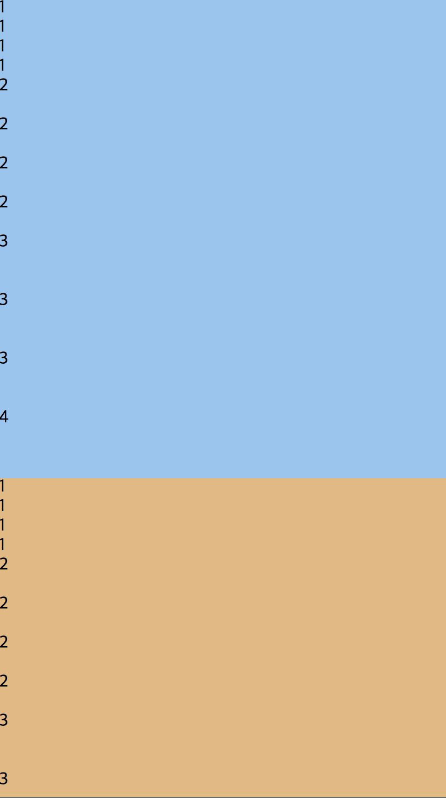

# E92's hybrid_app_style_guide

## Container

### Width 고정을 할 경우

hybrid app을 만들더라도 Base는 Web이며 Web에서도 모바일 환경과 동일하게 보여주기 위해 컨테이너의 `Width`를 `600px`로 고정한다.

```html
<div class="container">
    ...
</div>
```


### Height 고정을 할 경우

내부에 Div `Height`를 `%`로 나누어 면적을 나누고 싶을 경우에 `div.container`내부 면적의 총 `height` 합이 `100%`으로 맞춰지면 된다.

```Html
<div class="container">
    <div style="height: 40%">
        ...
    </div>
    <div style="height: 60%">
        ...
    </div>
</div>
```


* Div 내부의 내용이 많아 부득이하게 다른 영역을 침범하거나 스크롤 바가 생겨 `height` 고정이 안될 경우 `div.container_hidden` 또는 `div.container_scroll`을 삽입하면 된다.
  * `div.container_hidden`의 경우 설정 된 면적이 초과 될 경우 내용을 숨겨 버린다.
  * `div.container_scroll`의 경우 설정 된 면적이 초과 될 경우 내부에 Scrollbar를 만든다. 

```html
<div class="container" >
        <div class="container_scroll" style="height: 60%; background-color:rgb(144, 197, 241)">
            1<br>1<br>1<br>1<br>
            2<br><br>2<br><br>2<br><br>2<br><br>
            3<br><br><br>3<br><br><br>3<br><br><br>
            4<br><br><br><br>4<br><br><br><br>
            5<br>5<br>5<br>5<br>5<br>5<br>5<br>5<br>5
        </div>
        <div class="container_hidden"style="height: 40%; background-color: rgb(230, 184, 125)">
            1<br>1<br>1<br>1<br>
            2<br><br>2<br><br>2<br><br>2<br><br>
            3<br><br><br>3<br><br><br>3<br><br><br>
            4<br><br><br><br>4<br><br><br><br>
            5
        </div>
    </div>
```




## Header

화면의 제일 상단에 Header (`Tab Bar`)를 추가하고 싶을 경우 `header.header`를 통해 만들어 주면 된다.

Header를 추가하게 되면 header 영역만큼 Layout이 늘어나게 되는데 만약 `div.container`의 Layout을 `100%`로 유지하고 싶다면. `Div.container.header`로 만들어 주면 된다. (Header가 차지하는 영역만큼 `height`가 줄어든다.)

* Header 추가

  ```html
  <header class="header">
      헤더 영역입니다.
  </header>
  <div class="container">
      메인 영역입니다.
  </div>
  ```

* `div.container`의 `height`를 100%로 유지시킬 경우

  ```html
  <header class="header">
      헤더 영역입니다.
  </header>
  <div class="container header">
      메인 영역입니다.
  </div>
  ```


### Header Shadow

메인 영역에서 스크롤 시 Header영역에서 그림자 효과를 주고 싶다면 `header`에 `.shadow`를 추가하면 된다.
`container`영역에서 스크롤이 생길 경우 header에 그림자가 추가 된다.

```html
<header class="header shadow">
    헤더 영역입니다.
</header>
<div class="container header">
    메인 영역입니다.
</div>
```


